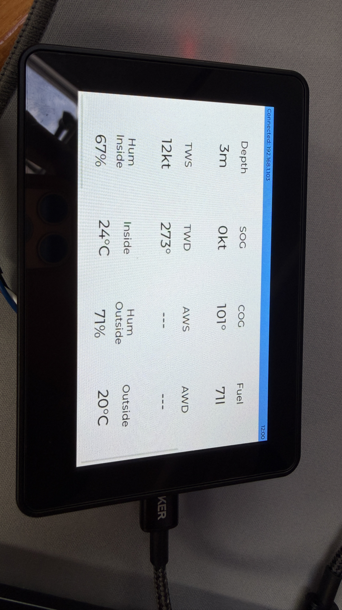
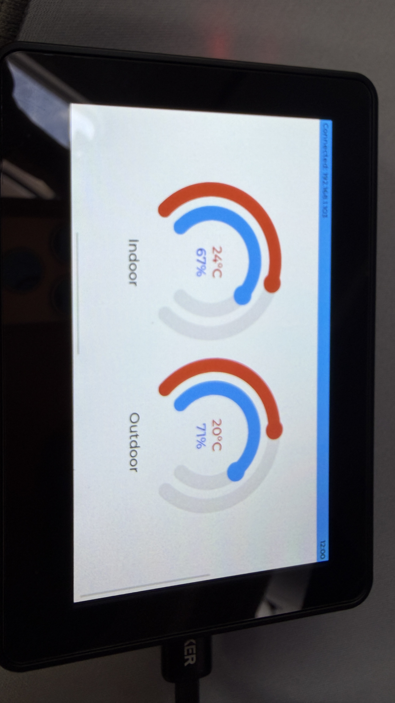
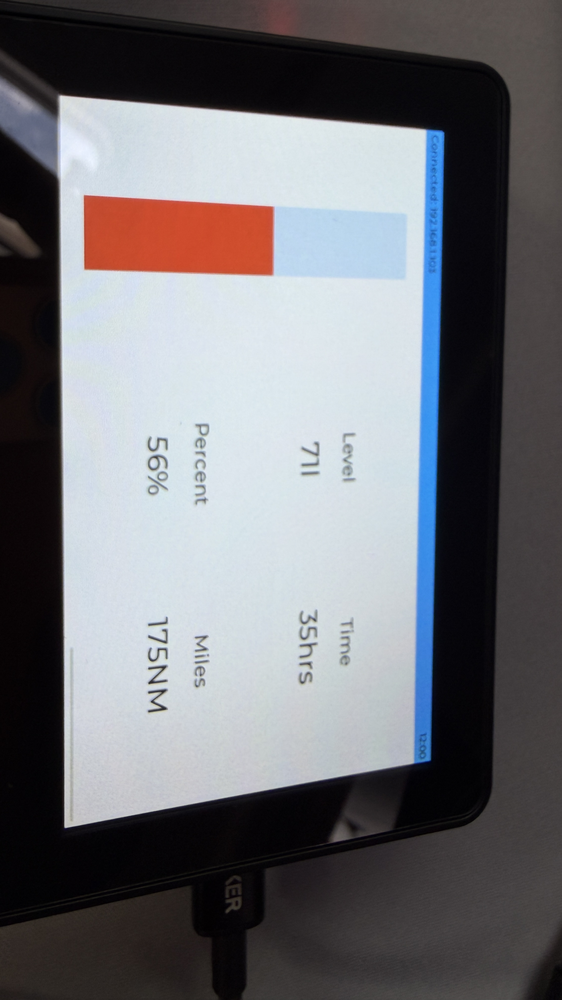
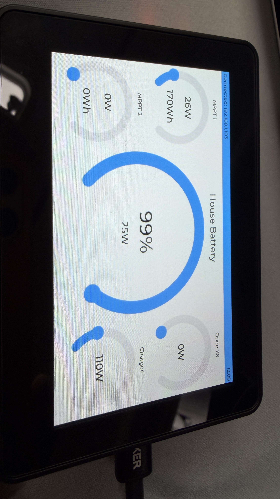

# ESP32BoatAssistant
A Boat assistant project using the Waveshare ESP32S3 4.3B Box hardware
Touchscreen display with full NMEA2000, MQTT and Bluetooth integration for Ruuvi, Victron and Boat systems.
Not currently configurable, everything is hardcoded to what I needed.
Hardware is the [Waveshare LCD4.3B](https://docs.waveshare.com/ESP32-S3-Touch-LCD-4.3B)

[app_main Startup]
  │── 1. Init Hardware (SPI, I2C, TWAI, Wi-Fi)
  │── 2. Init LVGL Base & Alloc Buffers
  │── 3. Create Mutexes & Queues
  └── 4. Spawn Tasks ──┐
                       │
         ┌─────────────┴────────────────────────┐
         ▼                                      ▼
  [CORE 1: UI & Input]                  [CORE 0: I/O & Network]
   ├── Task: LVGL Engine                 ├── Task: TWAI Receiver
   │    └── lv_timer_handler()           │    └── twai_receive()
   └── Task: Touch Interrupt Handler     └── Task: REST API Client
        └── Reads I2C touch coords            └── HTTP Request/cJSON

screens:
| Settings | Wifi        | <blank>  |
| NMEA     | Environment | Screen 2 |
